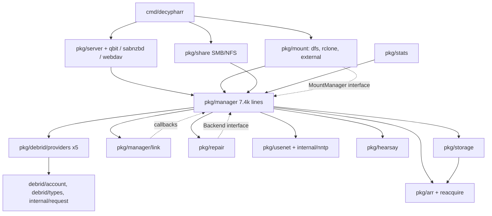

# Decypharr fork audit: `dev` ee67efd

Date: 2026-09-27. Tree: `/tmp/decypharr-wt/audit` (detached `dev` ee67efd = upstream `beta` 249ac9e + round 1). All runs use go1.26.5, the `go.mod`/Dockerfile toolchain, unless stated otherwise. The review is weighted towards al's install: Real-Debrid + TorBox Pro, DFS FUSE mount (hanwen backend), no usenet, no arrs, SMB/NFS off, UI behind Pangolin.

**Legend**
- **verified**: reproduced with a test, the live server or tool output, or the full code path was read.
- **[INFERENCE]**: plausible, but not reproduced or traced end to end.
- Throwaway proofs ran as `go test -overlay` files kept outside the repo, so the worktree stayed clean. Nothing from them is committed.

**Coverage gap**

Three delegated review slices were cancelled at the request budget before they reported:
- a deeper concurrency pass over the account manager and the job queue (`pkg/debrid/account`, `pkg/manager/{queue,jobqueue,active_queue,processor}.go`);
- the per-refresh provider API-call budget for N torrents;
- the rest of the auth sweep: qBit/SAB auth, `api_browse` downloads, SSRF in `utils.DownloadFile`/`OpenMagnetHttpURL`, CSRF on state-changing routes, path traversal in symlink/save paths.

The security, link-service and DFS items below were verified directly. The DFS items came from the one delegated review that finished.

## 1. Verdict on the split

**The edges are split well; the middle is not. The leaves can be ported package by package. `pkg/manager` and the DFS listing/removal path should not be ported as they are.**

**Clean seams (port-ready once specced)**

- Providers sit behind `pkg/debrid/common.Client` (`interface.go:12-36`).
  - RD depends on 9 internal packages and TorBox on 8 (config, logger, request, utils, customerror, account, types, rar/version).
  - Neither imports manager, server or storage.
  - The fork's `api_host` seam already lets a fake provider replay fixtures.
- `internal/config` is a leaf. Snapshots are immutable and atomically swapped; edits go through copy-on-write `Update` (`runtime.go:13-87`). No production code writes to a published snapshot.
- The DFS read path reaches the manager through a 4-method interface, `vfs.Backend` (`vfs/backend.go:13-22`).

**The hub**

`pkg/manager` has:
- 7,387 lines in 28 files;
- 83 exported methods on `*Manager`;
- 25 internal imports;
- 12 service-locator accessors (`accessor.go:26-92`).

It constructs every subsystem (`manager.go:124-296`, `debrid.go:45-79`): all five providers, usenet, repair, the arr services, hearsay, strm, notifications, the link service and the job queue.

The consumers depend on the concrete type:
- server, qbit, sabnzbd, webdav, share, stats and all three mount types take `*manager.Manager`;
- the server reaches through it to internals (`api.go:124` `s.manager.Queue().ListFilter`, `stats.go:167,178` `c.mgr.Storage()`).

As a result:
- `pkg/mount/dfs/vfs` transitively depends on 40 of the 61 packages (all providers, usenet, hearsay, repair, arr) because it imports `pkg/manager` for two types;
- qbit and webdav each depend on 38.

**Config is a process global**

- 97 `config.Get()`/`GetAuth()` calls in 28 packages.
- `logger.New` reads it (`logger.go:51-52`).
- `config.Get()` calls `os.Exit(1)` on a load error (`runtime.go:37-40`).

Every package needs a config file on disk before it can be tested or ported in isolation.

**Port order**

1. config, the RD/TorBox providers, storage (via a JSON export), the qBit/SAB/WebDAV HTTP surfaces and the UI, each on its own.
2. The manager and DFS only after the consumer interfaces in §5 exist.

## 2. Architecture map

### Numbers

- **Size:** 61 packages; 71,284 non-test lines (including the generated `storage.pb.go` at 1,467 lines and `nzb.pb.go` at 609); 23,908 test lines.
- **Fan-in:** `internal/config` 38, `internal/logger` 28, `internal/utils` 26, `pkg/storage` 17, `internal/customerror` 16, `pkg/debrid/types` 15, `pkg/manager` 13.
- **Fan-out:** `pkg/manager` 25, `pkg/server` 14, `pkg/repair` 12, `pkg/usenet` 10, `pkg/mount/dfs/vfs` 10.
- **Largest files:**

  | File | Lines |
  |---|---:|
  | `internal/nntp/client.go` | 1,772 |
  | `vfs/downloaders.go` | 1,618 |
  | `pkg/usenet/usenet.go` | 1,389 |
  | `vfs/cache.go` | 1,357 |
  | `usenet/parser/rar.go` | 1,345 |
  | `realdebrid.go` | 1,105 |
  | `server/api.go` | 904 |
  | `manager/downloader.go` | 900 |

- **Largest functions:** 41 of 2,583 functions are longer than 100 lines.

  | Function | Lines | Location |
  |---|---:|---|
  | `RARParser.parseArchive` | 258 | `usenet/parser/rar.go:340` |
  | `Server.setupCompleteHandler` | 184 | `server/setup.go:116` |
  | `Config.setDefaults` | 178 | `config.go:540` |
  | `Manager.getEntryChildren` | 177 | `manager/entry.go:214` |
  | `rclone performMount` | 158 | `mount/rclone/client.go:34` |
  | hanwen `Backend.Mount` | 157 | `backend.go:65` |
  | `Fixer.MoveTorrent` | 146 | `fixer.go:211` |
  | `Config.applyEnvOverrides` | 143 | `env.go:26` |

- **Global state:**
  - config snapshot and path (`runtime.go:13-17`);
  - logger singletons (`logger.go:16-20`);
  - a default request-client singleton (`request.go:23-26`);
  - NNTP timeouts (`nntp/client.go:244-261`);
  - the DFS backend registry (`backend/interface.go:44`);
  - `sync.Pool`s.

  The problem is how far config and the logger reach, not how many globals there are.
- **Dependencies:** 32 direct modules and 441 third-party packages in the binary.
  - 206 of those packages are reachable only through `pkg/hearsay`: anacrolix torrent + DHT, pion WebRTC/DTLS/STUN/TURN, OpenTelemetry.
  - They include all three cgo packages that only hearsay needs (go-llsqlite ×2, go-libutp).

### Layering violations (verified)

1. **Storage persists arr client types.** `pkg/storage` imports `pkg/arr` (`storage/types.go:12,579` for `Arr arr.Arr`; `proto.go:358-374` for `arr.ContentFile`). The persistence format depends on an HTTP-client package.
2. **Usenet domain types live in storage.** `pkg/usenet/types` imports `pkg/storage` (`range.go:22-55`, `volume.go:9`).
3. **DFS pulls in NNTP for one predicate.** DFS imports the NNTP stack only for `nntp.IsArticleNotFoundError` (`downloaders.go:776`).
4. **The FUSE backend bypasses the seam.** hanwen reaches the concrete manager through `vfs.Manager.GetManager()` (`vfs/manager.go:62`) 21 times, using 7 methods for listing and removal. The 4-method seam only covers reads.
5. **The provider interface leaks.**
   - `common.Client` returns `*account.Manager` (`interface.go:29`).
   - 16 of its 22 methods take no `context` (`interface.go:13-35`).
   - Providers read the global config (`torbox.go:60,641`, `realdebrid.go:65`, `account/manager.go:43`).

### Runtime cycles through interfaces and callbacks

The import graph is acyclic, but at runtime these edges point back into the manager:
- `repair.Backend` is implemented by `*Manager` (`manager.go:122,283-292`; `repair/service.go:66-71`).
- The link service calls back through `m.refreshTorrent`, `m.ReinsertEntry` and `AddOrUpdate` (`manager.go:328-337`).
- The strm reconciler calls `OpenStreamUntracked` (`manager.go:263-265`).
- `reacquire.NewHandler(m.arr, m)` passes the manager in (`manager.go:302`).
- The mount managers import the manager and are then injected back into it (`cmd/decypharr/main.go:64-65`).

### Port fitness

| Area | Seam | Before porting |
|---|---|---|
| `internal/config` | leaf; JSON Schema exists | inject instead of `Get()` |
| RD/TorBox providers | `common.Client` | add ctx; TLS on; typed errors |
| `pkg/storage` | appendstore + proto | own DTOs; JSON export |
| qBit/SAB/WebDAV/UI | chi routes | consumer interfaces; OpenAPI |
| DFS read path | `vfs.Backend` (reads only) | route listing/removal through an interface; move `StreamReader`/`FileInfo` out of manager |
| `pkg/manager` | none | split (§5) |

## 3. Tool results (triaged)

### `go vet ./...`

Clean on go1.26.5 and go1.27.1. The only output is a C compiler warning from go-llsqlite's bundled `sqlite3.c`, which comes in through hearsay.

### staticcheck 0.8.1

17 findings:
- **SA4023, a real bug:** `webdav/actions.go:59-60`. `CopyEntry` (`entry.go:472-480`) always returns an error, so WebDAV COPY/MOVE always answers 500. See L4.
- **SA1019 (deprecated):** `golang.org/x/net/context` in `mount/rclone/client.go:14`; `metainfo.Magnet` in `utils/magnet.go:96`.
- **14× ST1005:** capitalised error strings. Style only.

### govulncheck v1.8.0

10 reachable vulnerabilities.

Seven are in the standard library and fixed in go1.26.6:

| ID | Package |
|---|---|
| GO-2026-6218 | net/url |
| GO-2026-6091 | html/template (reachable from `BrowseHandler`) |
| GO-2026-6090 | crypto/tls |
| GO-2026-6089 | net/http `ReadHeaderTimeout` |
| GO-2026-6088 | encoding/xml |
| GO-2026-5972 | encoding/asn1 |
| GO-2026-5026 | idna, via net/http |

Three are in modules, all reached through `hearsay.Service.Start`:

| ID | Module | Upgrade |
|---|---|---|
| GO-2026-6278 | gorilla/websocket | 1.5.0 → 1.5.3 |
| GO-2026-6165 | pion/dtls/v3 (panic) | 3.0.3 → 3.1.4 |
| GO-2026-6163 | pion/stun/v3 (panic) | 3.0.0 → 3.1.5 |

### `go test -race`

`-race` on `./pkg/mount/... ./pkg/manager/... ./pkg/debrid/... ./pkg/storage/...` passed all 14 test packages with no race reported. Coverage is thin on the paths that matter:

| Package | Coverage |
|---|---:|
| realdebrid | 21.2% |
| torbox | 65.3% |
| manager | 36.3% |
| link | 43.2% |
| account | 47.6% |
| storage | 23.5% |
| vfs | 58.1% |
| hanwen | 20.5% |
| dfs | 0% |
| webdav | 25.9% |
| server | 23.3% |

A targeted overlay test did find a race (L1).

## 4. Findings by severity

### Critical

None found in the covered scope.

### High

**H1. Reflected DOM XSS in `/browse`, and `GET /api/config` returns every provider key** (verified)

- **Evidence:**
  - `browse.js:136-139` copies `?path=` into `state.currentPath`.
  - `updateBreadcrumbs` (`browse.js:352-366`) inserts `data-path="${currentPath}"` without escaping, through `innerHTML`.
  - A path with four or more segments makes `loadEntries` fall back to the root listing (`browse.js:222-234`). That request returns 200, so the breadcrumbs are always rendered.
  - Headless Chromium against the live binary: `/browse?path=/a/b/c/">` ran the handler.
  - In that page, `fetch('/api/config')` returned `api_key` and `download_api_keys` for the provider. `handleGetConfig` (`api.go:284-311`) serialises the whole config except the session secret.
- **Impact:** one crafted link opened by al through Pangolin exposes his RD/TorBox tokens and lets the page change settings.
- **Fix:**
  - Escape `data-path` with `escapeAttr`, or build the nodes with `textContent`/`dataset`.
  - Redact the fields the schema already marks `writeOnly` from `GET /api/config`, and accept "unchanged" on save.
  - Add a CSP without `unsafe-inline`.

**H2. WebDAV is unauthenticated by default, can delete from the provider, and allows any origin** (verified)

- **Evidence:**
  - Auth only applies when `use_auth && enable_webdav_auth` (`webdav/handler.go:152-168`). `enable_webdav_auth` defaults to off.
  - A DELETE on a file goes `actions.go:36-42` → `RemoveEntry` (`entry.go:439-470`) → `RemoveTorrentFile` (`entry.go:482-512`) → `DeleteEntry(…, true)` (`manager.go:720-728`) → `RemoveTorrentPlacements` (`callbacks.go:25-29`) → provider `DeleteTorrent`.
  - `commonMiddleware` sends `Access-Control-Allow-Origin: *` and allows DELETE/PROPFIND (`handler.go:140-149`).
  - Overlay test with `use_auth=true` and a password set: an unauthenticated DELETE carrying `Origin: evil` returned 204, the fake TorBox received `{"torrent_id":42,"operation":"delete"}`, and the entry left storage.
  - On the live server, the DELETE preflight from an arbitrary origin succeeded, and PROPFIND responses are readable cross-origin.
- **Impact:** anyone on the LAN, or a web page opened by a LAN user, can list the library and delete torrents from RD/TorBox. Private Network Access rules in some browsers may block the web-page route [INFERENCE]. Behind Pangolin SSO the public route is covered by the proxy [INFERENCE].
- **Fix:**
  - Enforce WebDAV auth whenever `use_auth` is on.
  - Remove the wildcard CORS headers.
  - Make WebDAV read-only unless a flag allows DELETE.
  - For al, today: set `enable_webdav_auth`, or `disable_webdav` if WebDAV is unused.

**H3. TLS certificate verification is off for every outbound client** (verified)

- **Evidence:**
  - `request.New` sets `skipTLSVerify: true` and no option turns it off (`request.go:199-252`). That client carries the RD/TorBox `Authorization: Bearer` headers (`realdebrid.go:52-54,89-90`; `torbox.go:61-63,94`; `account/manager.go:50-70`), the arr API keys and rclone.
  - The stream/CDN client sets `InsecureSkipVerify: true` (`manager.go:144-149`).
  - NNTP does the same (`nntp/client.go:926-930`).
  - Overlay test: the default client sent `Bearer SECRET` to a self-signed `httptest` TLS server without complaint.
- **Impact:** anyone on the path (hostile network, DNS hijack, compromised router) can capture API keys and bearer CDN URLs, and can inject content into streams.
- **Fix:** verify by default, with an explicit per-provider `insecure_skip_verify`. Keep `MinVersion` TLS 1.2.

**H4. Hearsay public P2P participation is on by default** (verified: code, docs, govulncheck, dependency count; the crash consequence is [INFERENCE])

- **Evidence:**
  - With any debrid configured, hearsay participates and publishes (`config/hearsay.go:25-31`; `hearsay.go:63-128,213-258`). This is documented in `docs/.../guides/hearsay.md:8`.
  - It joins the BitTorrent DHT, gossips, and relays up to 1 GiB of other nodes' data (`hearsay transport.go:38`).
  - It publishes cached/uncached observations of the infohashes decypharr adds or probes, under a persistent ed25519 identity.
  - The three reachable module CVEs above, two of them remote panics in pion DTLS/STUN, are reachable only through it.
  - 206 extra third-party packages and the libutp/sqlite cgo code come with it.
- **Impact:**
  - Privacy: al's IP is linked to infohashes.
  - Attack surface: a remote peer could crash the process that hosts the FUSE mount, if the panic is unrecovered [INFERENCE].
  - Cost: RSS, disk and open ports.
  - al adds through DMM, so fewer observations are published, but the node still runs.
- **Fix:**
  - For al, now: `DECYPHARR_HEARSAY__DISABLED=true`.
  - In the fork: default off, a build tag to exclude the package, and bump pion and gorilla.

### Medium

**M1. The TorBox API token ends up in error text and logs** (verified)

- **Evidence:**
  - `requestdl` sends `token=<key>` in the query string (`torbox.go:558-569`).
  - retryablehttp v0.7.8 `redactURL` only strips the userinfo password, and its errors embed the full URL.
  - Overlay test: the error text was `…/requestdl?file_id=3&token=dl-token&torrent_id=7 giving up after 4 attempt(s)`.
  - Sinks:
    - the DFS debug log `download error` (`downloaders.go:766-769`), also kept in `lastErr`;
    - WebDAV error logs (`actions.go:108-124`);
    - the stats ERROR log, which printed a full provider URL on the live instance.
- **Fix:**
  - Set a retryablehttp `ErrorHandler` in `internal/request` that strips query values.
  - Log `url.Error` values only through a redactor.

**M2. Errors are classified by substring, so transient DFS errors trip the circuit breaker** (verified; production frequency is [INFERENCE])

- **Evidence:**
  - `IsPermanentError` matches `"404"`, `"401"`, `"403"`, `"402"`, `"410"`, `"gone"`, `"forbidden"`… anywhere in an untyped message (`customerror/retry.go:37-51,118-146`), and that check runs before the retriable checks (`retry.go:67`).
  - The DFS truncation error prints byte offsets (`downloaders.go:1410-1416`).
  - Overlay test: 8.7% of 1 MiB-aligned truncation errors in a 20 GiB file are classed as permanent. Example offset: `2147404800`.
  - A permanent error is not retried (`downloaders.go:1268`) and trips the breaker at once (`downloaders.go:776-782`), which locks the file for 2 minutes (`downloaders.go:45`).
  - Titles such as "Gone Girl" and tokens containing "404" flip `ECONNRESET` to permanent the same way.
- **Fix:**
  - Classify only typed errors and structured HTTP statuses.
  - Wrap the truncation error in a retryable type.

**M3. The FUSE layer returns short successful reads, possibly EOF, on cancellation and unexpected EOF** (verified by reading)

- **Evidence:**
  - `skippableError` treats `io.EOF`, `io.ErrUnexpectedEOF` and `context.Canceled` alike (`hanwen/file.go:125-130`).
  - `Handle.Read` then returns `dest[:n]` with status 0, which leaves its `EINTR`/`EOF` branches unreachable (`handle.go:63-78`).
  - The disk tier returns `ErrUnexpectedEOF` for missing bytes (`buffer.go:386-400`).
- **Impact:** a 0-byte successful read mid-file looks like EOF to Plex/ffmpeg, so playback or a scan ends early without an error.
- **Fix:** skip only `io.EOF`. Map `Canceled` → `EINTR` and `ErrUnexpectedEOF` → `EIO`, or re-fetch the range.

**M4. The link-service singleflight runs with the first caller's context** (verified)

- **Evidence:**
  - `GetLink` and `Refresh` run the shared fetch with the first caller's `ctx` (`link/service.go:82-94,100-118`).
  - Overlay test: caller B, whose context was live, received caller A's `context deadline exceeded`.
- **Impact:** a WebDAV, STRM or repair request that is aborted fails the concurrent DFS downloaders for the same file. Combined with M3, a `Canceled` can reach the reader as EOF [INFERENCE]. This is the same class of bug as upstream #428.
- **Fix:** `DoChan` with `context.WithoutCancel(ctx)` plus the service's own timeout; each caller selects on its own `ctx`.

**M5. Each DFS cache item's metadata writer outlives its handles** (verified by reading)

- **Evidence:**
  - Every new `CacheItem` starts a goroutine with a 2 s ticker (`cache.go:600-603,1039-1049`).
  - It stops only when idle cleanup runs: 1 min idle, cleanup every 5 min (`cache.go:37`, `dfs/config.go:62`).
- **Impact:** a Plex scan over N files leaves N goroutines and tickers alive for about 6 minutes.
- **Fix:** stop the writer on the last `Release`, or use one shared flusher.

**M6. The DFS RAM cap has a one-block-per-buffer floor** (verified by reading)

- **Evidence:** `shareFor` and `trimTo` never go below one 1 MiB block (`pool.go:239-252`, `buffer.go:910-918`, `buffer.go:16`). The default budget is 512 MiB (`internal/config/mount.go:105-115`).
- **Impact:** every buffer retained during a scan keeps at least 1 MiB, so scans can exceed the cap.
- **Fix:** let inactive disk-backed buffers trim to zero resident blocks.

**M7. Disk-cache sizing assumes about four full-window streams** (verified by reading)

- **Evidence:** from the DFS review; I did not re-trace this one.
  - `cache.go:147-179` and `dfs/config.go:168-184` size the protected back-window for about four full-window streams.
  - With a disk cap and five or more streams, `reserveDisk` returns `ErrDiskLimit` (`pool.go:369-378`). The downloader write fails and the reader gets EIO.
- **Fix:**
  - Scale the protected window by the number of active buffers.
  - Under pressure, keep the requested range instead of failing the read.

**M8. The HTTP server's lifecycle is fragile** (verified live and by reading)

- **Evidence:**
  - The `http.Server` has no Read, ReadHeader or Idle timeouts (`server.go:187-190`). GO-2026-6089 concerns `ReadHeaderTimeout`.
  - A bind failure is only logged and the process keeps running without HTTP (`server.go:192-198`). On the live run with port 8282 taken, the process stayed up.
  - `Shutdown(context.Background())` waits indefinitely for streaming responses (`server.go:200`), so a `docker stop` can SIGKILL before the FUSE unmount [INFERENCE].
- **Fix:** add timeouts, exit on listen error, and give shutdown a bounded context.

**M9. Startup is blocked by a synchronous provider call** (verified live)

- **Evidence:** `stats.New` (`server.go:105`) builds its first snapshot synchronously (`stats.go:40-50`). That includes `GetProfile` with retries (`stats.go:265-300`).
- **Measured:** with the provider unreachable (connection refused), the UI/API/qBit/WebDAV listener started 7 s late. The manager and the DFS mount start after it.
- **Worse cases:** a blackholed host costs minutes (30 s dial × 4 attempts) [INFERENCE].
- **Fix:** build the first snapshot asynchronously.

**M10. Seven standard-library CVEs are reachable** (verified)

- **Evidence:** govulncheck, §3.
- **Fix:**
  - Set `go.mod` to go1.26.6 or later.
  - The Dockerfile's floating `golang:1.26-alpine` tag picks up the fix on rebuild. Rebuild the image.

**M11. Rate limits multiply, or are missing entirely** (verified by reading)

- **Evidence:**
  - `main`, `repair` and `download` each get their own limiter from `rate_limit` (`manager/debrid.go:49-57`). The effective per-key rate can reach three times the provider limit.
  - An empty `rate_limit` produces a nil limiter (`utils/http.go:18-21`), which means no limiting at all for RD (`request.go:120-128`).
  - `DefaultRateLimit` is used only by the setup wizard (`setup.go:161`).
  - `Debrid.Workers` is computed as NumCPU×50 per debrid (`internal/config/debrid.go:55-80`) and never read.
- **Fix:** one shared limiter per API key, a default in `updateDebrid`, and delete `Workers`. al should confirm `rate_limit` is set for both providers.

### Low

**L1. RD `GetProfile` data race** (verified)

- **RD:** `GetProfile` reads and writes `Profile`/`profileLastFetched` without synchronisation (`realdebrid.go:953-963`). `New` also runs it in a goroutine (`realdebrid.go:97-102`). `-race` reports DATA RACE at `realdebrid.go:961-962`.
- **TorBox:** caches its profile forever, also without synchronisation (`torbox.go:764-767`).
- **Fix:** guard with a mutex or atomic plus singleflight, and add a TTL for TorBox.

**L2. UI transfer cost** (verified live)

- `/assets` and `/images` are served from `embed.FS` with no Cache-Control, ETag, Last-Modified or compression (`routes.go:17-20`), so each page view re-downloads everything.
- `logo.png` is 1,471,291 bytes (1024×1024) and is shown at 32 px on every page (`layout.html:69`).
- A dashboard view is about 1.95 MB:

  | Asset | Size |
  |---|---:|
  | `logo.png` | 1.47 MB |
  | `styles.css` | 218 KB |
  | woff2 font | 131 KB |
  | jQuery | 88 KB |
  | page JS | ~27 KB |

- The settings page adds a 151 KB template and 91 KB of JS.
- **Fix:** a ~4 KB logo, hashed asset names with `immutable` caching or ETags, and gzip middleware.

**L3. Polling** (verified by reading)

- Browser side, none of which pause when the tab is hidden:

  | Page | Interval | Location |
  |---|---|---|
  | Dashboard | 10 s (`setInterval`) | `dashboard.js:496-500` |
  | Reacquire | 5 s | `reacquire.js:97` |
  | Repair | 15 s idle, 2 s while running | `repair.js:364` |
  | Stats | 30 s | `stats.html:1676` |

- Server side, the stats collector runs every 5 s whether or not anyone is watching (`stats.go:90-103`). Each run does `ReadMemStats`, two storage counts, a proto scan of the queue (`storage/queue.go:84-94`) and a hearsay status.
- Provider profiles are cached by the providers, so the collector makes no extra API calls.
- **Fix:** pause polling on `visibilitychange`; compute stats on request with a 5 s TTL.

**L4. WebDAV COPY/MOVE always return 500** (SA4023; `actions.go:52-65`)

- **Fix:** return 501 or 403.

**L5. Every API response is pretty-printed** (`utils/http.go:53-61`)

- **Fix:** drop `SetIndent`.

**L6. pprof listens on every interface when enabled** (`main.go:33,55-61`)

- `ENABLE_PPROF` starts it on `:6060`, all interfaces, with no auth.
- **Fix:** default to `127.0.0.1:6060`.

**L7. Session cookie has no `Secure` flag** (`server.go:97-103`; HttpOnly and SameSite=Lax are set, 7-day lifetime)

- **Fix:** set `Secure` when served over HTTPS or behind a proxy.

**L8. IPv6 bind addresses do not work** (`server.go:185`)

- The listen address is built with `fmt.Sprintf("%s:%s")`, which produces an invalid address for an IPv6 bind address.
- **Fix:** use `net.JoinHostPort`.

**L9. Library code exits or panics** (verified)

- `config.Get` calls `os.Exit` (`runtime.go:37-40`).
- `manager.New` panics (`manager.go:129-132`), and so does the logger (`logger.go:28`).
- **Fix:** return errors to `cmd/`.

**L10. The refresh job invalidates everything every cycle** (`workers.go:133-140`, `workers.go:168-181`)

- Every refresh drops the whole entry cache and refreshes the mount, even when nothing changed.
- At midnight CET, `linkService.Clear()` makes every active stream refetch its link at once [INFERENCE on cost].
- **Fix:** invalidate only on change; let links expire individually.

**L11. Refreshes and most provider calls cannot be cancelled**

- `doRefreshTorrents` ignores its `ctx` (`torrent.go:66`), and so do most provider calls (see layering violation 5).

**L12. The DFS mount deletes from the provider** (design note, verified)

- Unlinking a torrent's last file deletes the torrent from RD/TorBox (`hanwen/dir.go:340-356` → `entry.go:482-512`).
- `rm -rf /mnt/decypharr/__all__/X`, or a media server's "delete media", removes it from the provider.
- Keep delete permissions off for the mount in Plex/Jellyfin.

## 5. Performance notes

### DFS read path

Benchmarks run on a Ryzen 7 5800X with go1.26.5.

| Benchmark | ns/op | Notes |
|---|---:|---|
| vfs `ReadAtContextWarm` | 6,087 | 128 KiB reads (~21 GB/s), 0 allocs |
| vfs `ReadAtContextFromDisk` | 16,859 | 128 KiB from the sparse-file tier |
| vfs `ReadAtContextWarmParallel` | 1,039 | |
| vfs `CacheWriterWrite` | 13,088 | 32 KiB writes |
| vfs `ColdReadWakeLatency` | 55,484 | wake p50 3.3 µs, p99 6.2 µs, max 82 µs |
| vfs `KickWaiters` | 596 | |

`internal/buffer`:

| Benchmark | Disk tier | Memory tier |
|---|---|---|
| `StreamSequential` | 933 MB/s | 3.1 GB/s |
| `StreamContendedReads` (4 readers + writer) | 424 MB/s; p50 23.7 µs, p99 2.97 ms, max 25.9 ms | 484 MB/s; p50 21 µs, p99 2.94 ms, max 51.5 ms |
| Warm re-read (`ReadWarmDisk` / `ReadWarmRAM`) | 2.9 µs | 0.8 µs |

**Reading them:**
- The CPU cost of the DFS read path is microseconds against 20–100 ms of CDN time-to-first-byte, so the network dominates.
- The contended p99 of about 3 ms appears in both tiers, so it comes from lock hold times (writer/reclaim), not from `pread`.
- M2–M7 matter more than raw speed.

### JSON and sonic

Provider responses go through `request.DecodeJSON`, which uses `encoding/json` (`decode.go:17-26`), not sonic. Sonic is used only for config, UI/API handlers, arr, and small RD/TorBox payloads.

`internal/request` benchmarks:

| Payload | go1.26.5 | go1.27.1 |
|---|---:|---:|
| 5,000 records / 714 KB | 7.8 ms | 3.8 ms |
| 20,000 records / 2.9 MB | 29.7 ms | 15.0 ms |

Allocation per decode is 3.25 MB for `DecodeJSON` and 0.72 MB for the streaming `DecodeJSONArray`.

**Takeaways:**
- Removing sonic costs nothing measurable on the RD/TorBox paths.
- The Go 1.27 bump halves decode time.
- `DecodeJSONArray` cuts decode memory about 4.5× for large pages.

### Link fetching (verified by reading)

- **TorBox:** one `requestdl` per file per hour (`torbox.go:546-596`).
- **Both providers:**
  - one HEAD validation per new link, memoised with an 8,192-entry cap (`link/service.go:193-199,425-460`);
  - concurrent reads of the same file are coalesced;
  - refetch cooldown of 5 min per file.
- **RD per-key rates:** see M11.

### Refresh

- Every 10 min per provider (`defaults.go:15`).
- It lists the full account and walks every stored entry (`torrent.go:66-178`).
- A TorBox Pro account also lists usenet items.
- The API calls per cycle for N torrents were not measured; that slice was cancelled.

### Idle footprint

Headless, no providers, hearsay disabled: 51.6 MB RSS and 19 threads. The binary is 40.7 MB stripped.

## 6. Recommended fork refactors before the port

1. **Inject config and logger** through constructors (a snapshot or a narrow interface). Forbid `config.Get()` below `cmd/` with a small `go/ast` test. Start with the providers, account, link and storage.
2. **Tighten the provider boundary:**
   - `ctx` on every `common.Client` method;
   - an interface instead of `*account.Manager`;
   - TLS verification on;
   - typed errors only (fixes M2);
   - redacted URLs in errors (fixes M1).
3. **Split `pkg/manager`** into catalog (entries and listings), jobs (queue, processor, downloader) and streams (session, link):
   - each consumer (webdav, qbit, sabnzbd, dfs, stats) declares its own small interface;
   - remove the `accessor.go` service locator.
4. **Detach DFS from the manager:**
   - move `StreamReader`/`FileInfo` into a small package so DFS stops importing the manager;
   - route hanwen listing and removal through `vfs.Backend` instead of `GetManager()`.
5. **Storage owns its DTOs:** drop the `pkg/arr` import and ship the documented JSON export.
6. **Server:**
   - timeouts, fail fast on bind, bounded shutdown, asynchronous first stats snapshot;
   - redact secrets from `GET /api/config`;
   - WebDAV auth defaults, no wildcard CORS;
   - an OpenAPI document generated from the chi routes.
7. **Hearsay** behind a build tag and off by default. This drops 206 packages and the cgo dependencies from the port reference.
8. **Toolchain:** go1.26.6 now. Then Go 1.27 with sonic removed (§5), which also needs the known `internal/request` drain-test fix.
